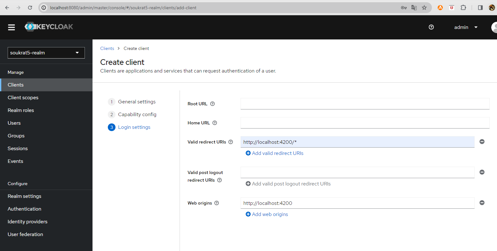
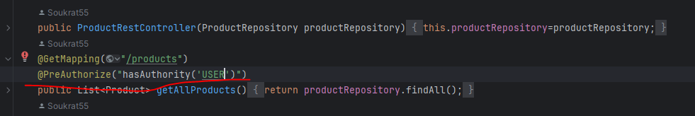
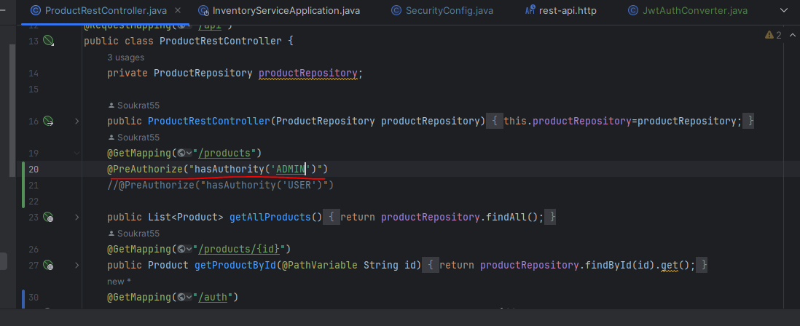
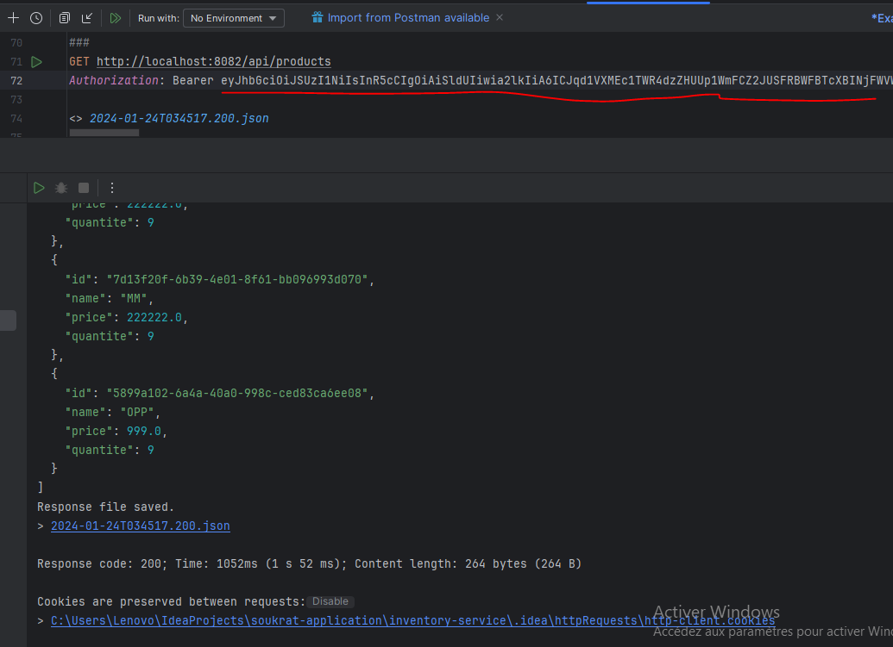

<h1>Rapport JWT ANGULAR SPRING BOOT OAUTH2 OIDC KEYCLOAK:</h1>
<h3>Login de localhost de spring boot</h3>

<h3>Les données inséré en json vers api/products</h3>

<h3>depandance api de spring boot</h3>

<h3>L'accées refusé de swagger car on a pas met dans la commande ".authorizeHttpRequests(ar->ar.requestMatchers())"</h3>

<h3>ajouter swagger dans la commande ".authorizeHttpRequests(ar->ar.requestMatchers""</h3>

<h3>l'accées de swagger </h3>

<h3>Les données des produits dans swagger</h3>

<h3>L'accées refusé de hé-console de base de données</h3>

<h3>pour l'accées il faut ajouter csrf et ajouter h2-console dans ".authorizeHttpRequests(ar->ar.requestMatchers())"</h3>

<h3>accées de h2-console</h3>

<h3>Accées refusé de base données aprés authentification</h3>

<h3>ajouter cette commande pour l'accées</h3>

<h3>L'accées à la base de données</h3>

<h3>demarrage de notre application angular</h3>

<h3>creer front end angular </h3>

<h3>affichage la liste des produits avec front-end angular et back-end spring-boot</h3>

<h3>les commandes de configuration </h3>

<h3>Démarrer Keyclock</h3>

<h3>Realm de keycloak</h3>

<h3>Création de client</h3>

<h3>donner le nom de client</h3>

<h3>puis clicker sur next</h3>

<h3> la redirection d'URL de front-end </h3>

<h3>Enregistrer les données de client</h3>

<h3>Ajout d'utilsateur</h3>

<h3>donner les informations de l'utilsateur créer</h3>

<h3>vers credantials ,on donne le mot de pass de l'utilisateur</h3>

<h3>ecrir le mot de pass de l'admin soukrat3</h3>

<h3>creation fini de l'admin soukrat3</h3>

<h3>aussi la mem chose pour utilisateur "user2"</h3>

<h3>mot de pass de user2</h3>

<h3>creation de role</h3>

<h3>creer role "USER"</h3>

<h3>et aussi creer role "ADMIN" </h3>

<h3>vers soukrat3 on click sur role mapping</h3>

<h3>pour choisir le role "ADMIN" et "USER"</h3>

<h3>et pour user2 on choisi le role "USER" seulement</h3>

<h3>On click sur ce lien</h3>

<h3>por aller vers ces données json pour recuperer le lien de token</h3>

<h3>et l'utiliser ce lien pour l'utiliser dans le testeur "rest-api.http"(comme posteman) </h3>

<h3>il va nous afficher les données de sécurité mais qui nous intersse c'est access_token </h3>

<h3>mettre la clé "acces_token" dans jwt.io pour qu'il nous affiche les données de sécurité de client</h3>

<h3>tester l'accées avec  la sécurité avec la clé refresh_token(200 OK)</h3>

<h3>Activer authentification client et aussi les comptes de service des roles</h3>

<h3>copier la clé secret de client </h3>

<h3>pour le tester et onvois il s'amarche bien</h3>

<h3>Le lien des données en json de realm (soukrat5-realm)</h3>

<h3>On teste les données qui se trouve dans api/products et on trouve qu'il y a erreur car il est securisé  </h3>

<h3>On decrypte ce lien avec la clé access_token</h3>

<h3>et on voit qu'il s'affiche les donnéees des produits</h3>

<h3>puis on ajoute le lien "/auth" pour l'authentification</h3>

<h3>puis donner la permission des données de produits seulemnt qui avait le role "USER"</h3>

<h3>Activer la methode de sécurité</h3>

<h3>puis tester encore une fois avec user2(car son role est "USER") et il s'a marche bien</h3>

<h3>puis on teste l'acces au données vers le lien "api/products" et aussi le lien"/auth" avec la clé acces_token (qui afficher avant ce code)</h3>

<h3>Ajouter la mezthode de JWT</h3>

<h3>puis on teste pour recuperer aussi la clé token-access</h3>

<h3>et l'utilser pour acceder au les données de "api/products"</h3>

<h3>et aussi authentification "/auth"</h3>

<h3>on modifie le role par "ADMIN" pour l'acces à la liste des produits</h3>

<h3>et pour recuper la clé access_token ,il faut modifier user2 (USER) par soukrat3( car il est ADMIN)</h3>

<h3>on utilse access_token pour accedezr aux données au tant que admin</h3>

<h3>et aussi s'authentifier au tant que admin (soukrat3)</h3>

<h3>On enleve authorisation dans le controlleur</h3>

<h3>et à sa place en met cette commande dans securityConfig</h3>

<h3>on teste et il s'a marche bien comme l'exemple précedante</h3>

<h3>On install keycloack angular dans le fichier de front-end d'angular</h3>

<h3>On insialise le keyclock avec son url ,notre realm (soukrat5-realm) et notre identite de client</h3>

<h3>On créer un package d'angular "guards/auth"</h3>

<h3>Voila l'affichage avant authentification</h3>

<h3>On desactive authentifcation client et service accounts role </h3>

<h3>et Quand on click sur "products" ,on donne login de notre realm(soukrat5-realm)</h3>

<h3>On va acceder aux données (liste des produits) au tant que admin (soukrat3)</h3>

<h3>et dans network ,on trouve les informations json de "product"</h3>

<h3>Et quand on click sur "Logout"</h3>

<h3>il va trouver "products" qui ne trouve pas dans bar menu car on a deconnecter</h3>

<h3>On va ajouter un registre on activant ces trois buttons</h3>

<h3>On trouve l'affichage de ce qu'on activer ,puis on click sur "new register"</h3>

<h3>pour creer un nouveau utilisateur (user3)</h3>

<h3>On voit qu'il creer au tant que "USER"</h3>

<h3>puis on deconnecte ,ensuite on connecte au tant que admin(soukrat3),et affichage la liste des produits</h3>

<h3> on ajouter cette condition pour products qui se trouve dans bar menu de ne pas affiche si seulement si il est admin</h3>

<h3>On teste avec OTP pour connecter avec mobile pour l'utilsateur "user2"</h3>

<h3>on connecte au tant que "user2"</h3>

<h3>Et on visualise un barcode qui tu va le scanner ,pour qu'il donne un code pour s'authentifier avec ce code</h3>

<h3>et ici d'autre information pour préciser votre authentification de votre mot de pass (policies)</h3>

